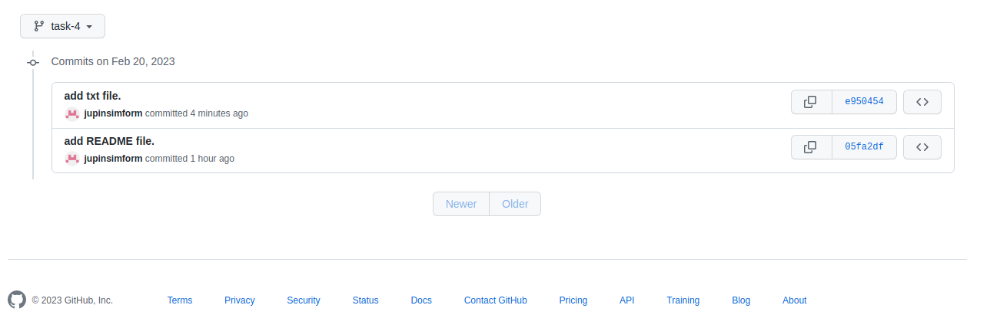
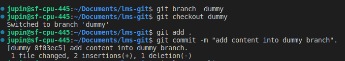
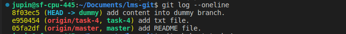
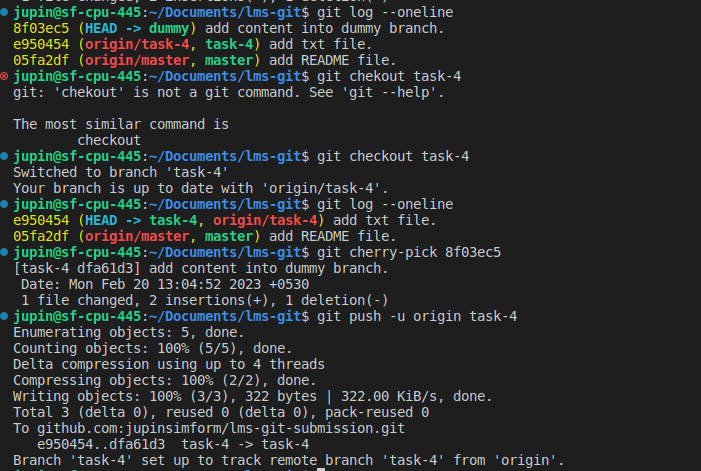
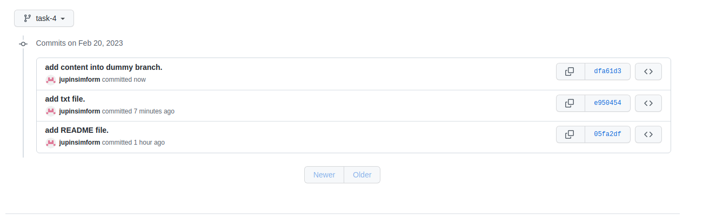

# Git LMS

## Cherry pick
    - Pick some commits from feature branch to master branch

        git cherry-pick is a powerful command that enables arbitrary Git commits to be picked by reference and appended to the current working HEAD. Cherry picking is the act of picking a commit from a branch and applying it to another. git cherry-pick can be useful for undoing changes.

step 1:create file and push that file into branch task-4

step 2:create another dummy branch,make some changes and commit those changes.

step 3: pick that commit in dummy branch and add this commit into task-4.

step 4:push those changes into task-4.
