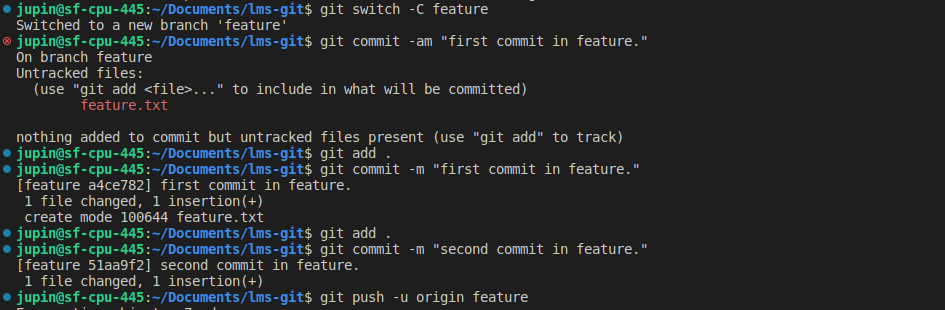
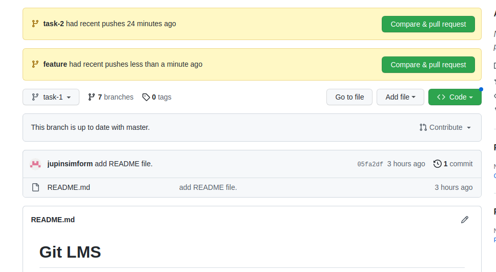
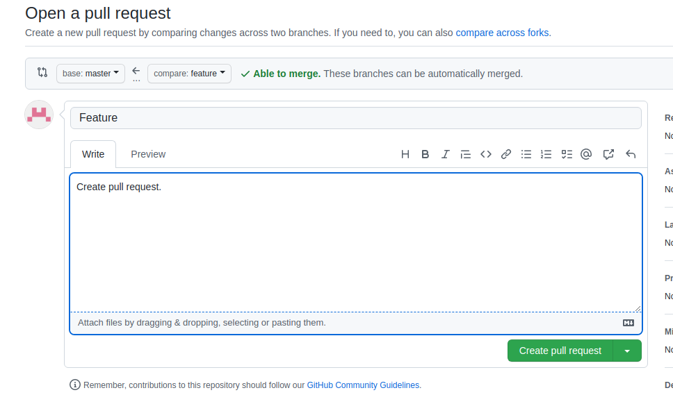
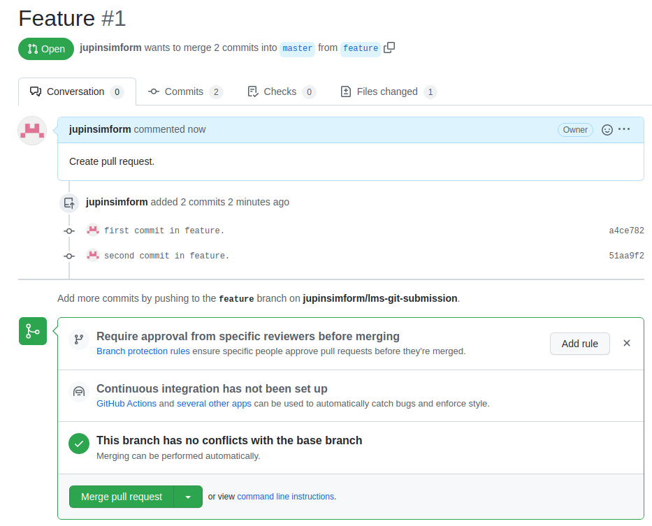
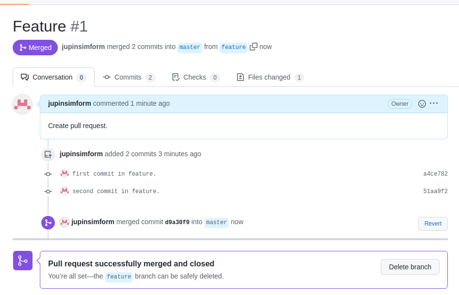
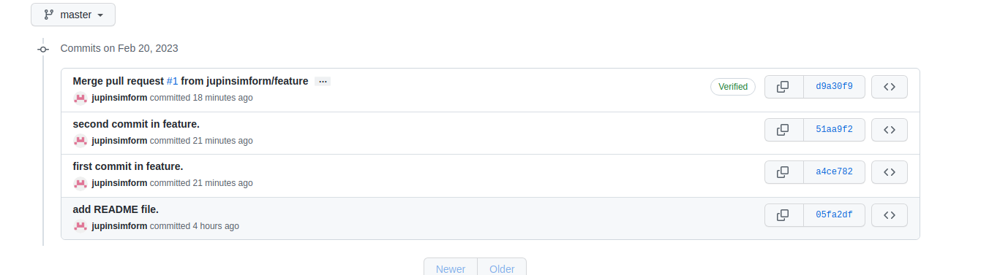

# Git LMS

## Pull and Merge difference
    Make example of pull request and two branch merge event.

## Difference Between a Pull Request vs. Merge Request
    A Git pull request is essentially the same as a Git merge request. Both requests achieve the same result: merging a developer’s branch with the project’s master or main branch. Their difference lies in which site they are used; GitHub uses the Git pull request, and GitLab uses the Git merge request.

| Command        | Description          
| ------------- |:-------------:
|git pull  | Fetch + merge

step 1:create a feature branch

step 2:comapre and pull request in feature branch

step 3:create pull request

step 4:merge pull request

step 5:after mergeing with master commit

## merging
    The git merge command lets you take the independent lines of development created by git branch and integrate them into a single branch.

Note that all of the commands presented below merge into the current branch.
| Command        | Description          
| ------------- |:-------------:
|git merge bugfix | Merges the bugfix branch into the current branch
|git merge --no-ff bugfix | Creates a merge commit even if FF is possible
|git merge --squash bugfix | Performs a squash merge
|git merge --abort  | Aborts the merge
|git branch --merged | Shows the merged branches
|git branch --no-merged | Shows the unmerged branches

Merge feature branch with task-1
