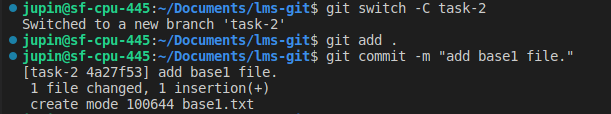
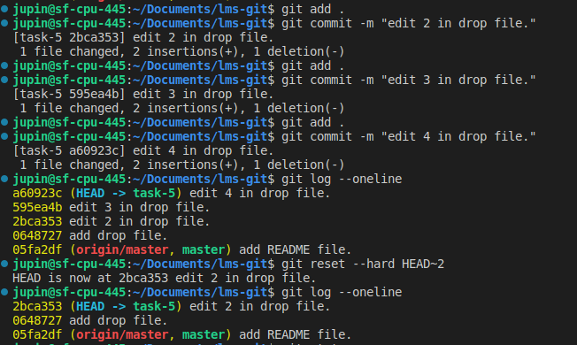

# Git LMS

## Drop commit
    Remove some commit from feature branch.

## reset
    To remove the last commit from git, you can simply run git reset --hard HEAD^ If you are removing multiple commits from the top, you can run git reset --hard HEAD~2 to remove the last two commits. You can increase the number to remove even more commits.

## revert 
    The git revert command is a forward-moving undo operation that offers a safe method of undoing changes. Instead of deleting or orphaning commits in the commit history, a revert will create a new commit that inverses the changes specified. Git revert is a safer alternative to git reset in regards to losing work.

## Difference bteween reset and revert

| git reset        | git revert          
| ------------- |:-------------:
|git reset does this by moving the current head of the branch back to the specified commit, thereby changing the commit history. | git revert does this by creating a new commit that undoes the changes in the specified commit and so does not change the history.
| |

## Difference between git rest hard,mixed and soft.

## Practical

step 1: create task-5 branch and make some commits on it.

step 2: drop commit using git reset command.

step 3:for multipal drop use HEAD~n.
