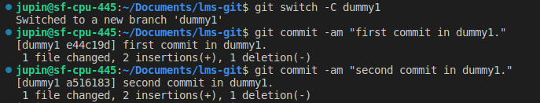
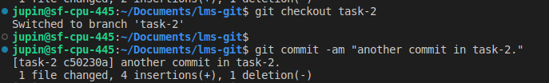
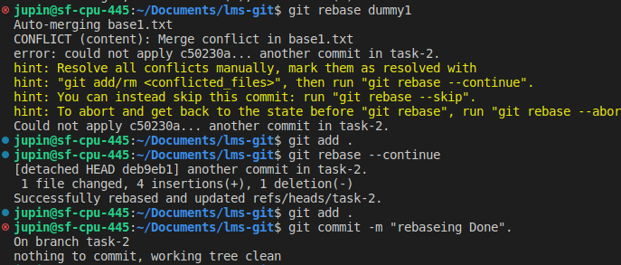

# Git LMS

## Rebase
    Try to rebase feature branch with master branch

## git rebase
    Rebase is one of two Git utilities designed to integrate changes from one branch onto another. Rebasing is the process of combining or moving a sequence of commits on top of a new base commit. Git rebase is the linear process of merging.

| Command        | Description         
| ------------- |:-------------:
|git rebase <base>	| Performs the standard rebase
|git rebase -- continue	| Continue with the changes that you made.
|git rebase --skip	| Skips the changes
|git add <project file>	| Adds your branch to the repository
|git commit -m "new commit for <branch name>." |	Commits the changes.

## Difference between merge and rebase
        In the process, rebase flattens the history, removing unwanted entries. Git merge, on the other hand, only changes the target branch and creates a commit, preserving the history of the source branch.

step 1:create new branch task-2 and add 1 commit into it.

step 2: craete another branch dummy1 and add 2-3 commit in it.

step 3: add another commit in task-2.

step 4:perform rebase in task-2 branch, solve the conflict and continue with reabseing.
