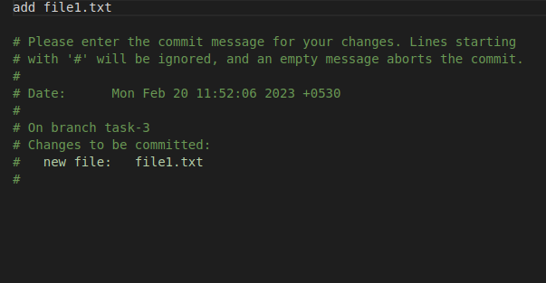

# Git LMS

## Change commit message
    Commit push on commit in feature branch and then change commit message.

## git amend
    The git commit --amend command is a convenient way to modify the most recent commit. It lets you combine staged changes with the previous commit instead of creating an entirely new commit. It can also be used to simply edit the previous commit message without changing its snapshot.

step 1: add file1.txt into remote with wrong commit message

step 2: apply git amend and change the message

step 3:push those changes into remote 

